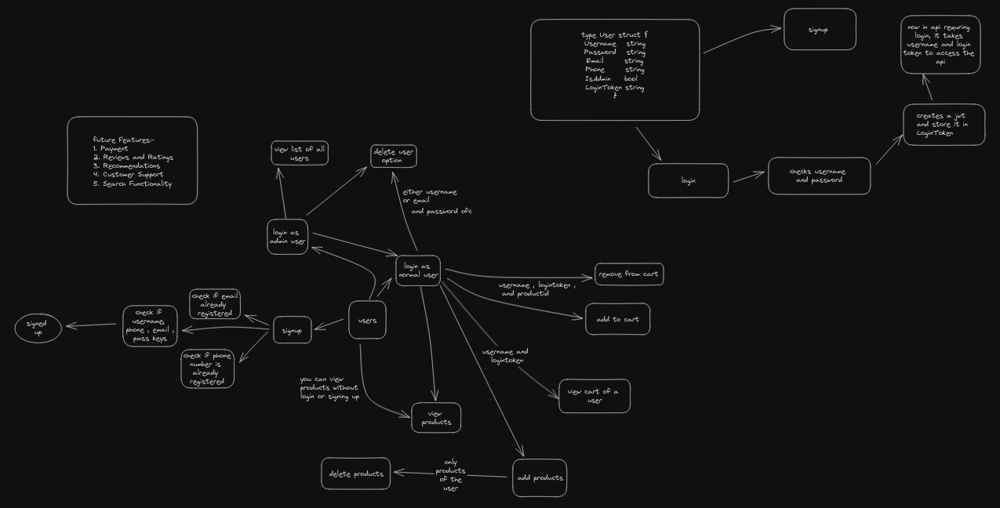

# Amazon Clone Project

## Table of Contents
- [Description](#description)
- [Features](#features)
- [Author](#author)
- [Technologies Used](#technologies-used)
- [Installation](#installation)
- [API Documentation](#api-documentation)
- [Future Ideas](#future-ideas)

---

## Description

This project is a clone of the popular e-commerce platform, Amazon, built using the Go programming language. It aims to replicate some of the core features and functionalities of Amazon.

---

## Features

- User Signup
- User Login
- Product Listing
- Shopping Cart Management
- Admin userrs
- Seller Account

---

## Author

- Name: [Bharat Raj Singal](https://www.linkedin.com/in/bharatrajsingal000/)
- Email: [Email](mailto:geeksingal@gmail.com)
- GitHub: [GeekWolf](https://github.com/geekwolf007)

---

## Technologies Used

- Go (Golang)
- MongoDB

---

## Installation

- Just clone the project
- cd into the project 
- write make run to run the project

## API Documentation

- The API is documented using Postman and can be found [here](https://documenter.getpostman.com/view/28140786/2s9YC4Usd1).
- The excalidraw file is 

---

## Future Ideas

- Payment
- Reviews and Rating
- Recommendations
- Search Functionality
- Customer Care
